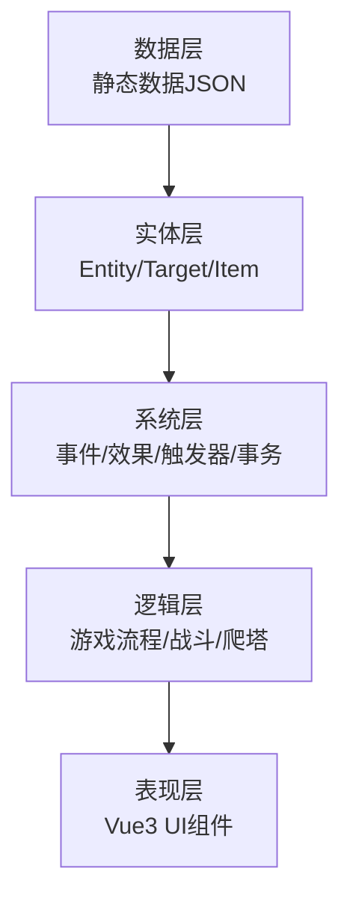
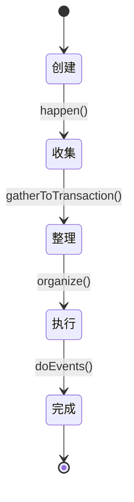
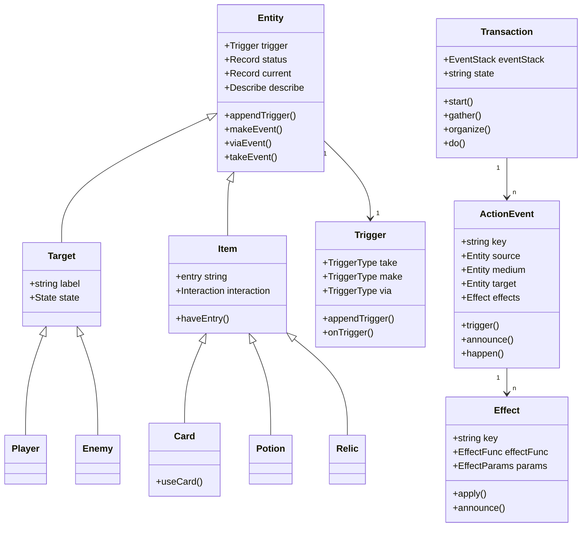

# Born The Spire - 系统架构

## 整体架构

Born The Spire 采用分层架构，从底层向上依次为：



## 核心系统

### 1. 事件驱动系统

**核心类**: [`ActionEvent`](../born_the_spire/src/core/objects/system/ActionEvent.ts:27)

事件是游戏中最基本的单位，所有游戏行为都通过事件触发和传播。

**关键特性**:
- 三要素：source（来源）、medium（媒介）、target（目标）
- 阶段机制：支持多阶段执行，每个阶段可独立配置条件和效果
- 事务收集：相关事件会被收集到同一个事务中
- 触发器触发：在 before/after 时机触发相关触发器

**事件生命周期**:


### 2. 效果系统

**核心类**: [`Effect`](../born_the_spire/src/core/objects/system/effect/Effect.ts:13)

效果是对实体产生影响的具体操作，所有效果都通过事件触发。

**三层结构**:
1. **EffectUnit**: JSON 配置中的效果单元
2. **Effect**: 运行时的效果对象
3. **EffectFunc**: 实际执行的效果函数

**效果映射表**: [`effectMap`](../born_the_spire/src/static/list/system/effectMap.ts:31)

通过注册表模式，将效果名称映射到效果函数，支持动态扩展。

### 3. 触发器系统

**核心类**: [`Trigger`](../born_the_spire/src/core/objects/system/trigger/Trigger.ts:11)

触发器监听特定事件并在适当时机响应，实现复杂的游戏逻辑。

**触发机制**:
- **when**: before/after - 事件发生的时机
- **how**: make/via/take - 实体在事件中的角色
- **key**: 事件的关键词
- **callback**: 触发时的回调函数

**特殊触发器**:
- **默认触发器**: 对象初始化时自带的触发器
- **关键触发器**: 支持替换和唯一性约束的触发器

### 4. 事务系统

**核心类**: [`Transaction`](../born_the_spire/src/core/objects/game/transaction.ts:9)

事务管理一系列相关事件的执行顺序，确保游戏逻辑的一致性。

**事务队列**: [`TransactionQueue`](../born_the_spire/src/core/objects/game/transaction.ts:68)

顺序处理并发的多个事件，每个事件独立创建一个事务。

**事务状态**:
- created: 已创建
- gathering: 收集事件中
- organizing: 整理事件中
- doing: 执行中

### 5. 状态管理系统

#### Status（属性）

**核心类**: [`Status`](../born_the_spire/src/core/objects/system/status/Status.ts)

相对静态的属性值，通过修饰器系统管理。

#### Current（当前值）

**核心类**: [`Current`](../born_the_spire/src/core/objects/system/Current/current.ts:26)

动态变化的当前值，如生命值、能量等。

**关键特性**:
- 上下限控制：maxBy/minBy
- 事务性操作：changeCurrentValue
- 回调机制：reachMax/reachMin
- 响应式：通过 Vue 3 ref 实现

## 实体系统

### Entity（实体基类）

**核心类**: [`Entity`](../born_the_spire/src/core/objects/system/Entity.ts:13)

所有游戏对象的基类，提供：
- 触发器系统
- 属性系统（status）
- 当前值系统（current）
- 描述信息

### Target（目标）

**核心类**: [`Target`](../born_the_spire/src/core/objects/target/Target.ts:15)

可以被选中和作用的对象，包括：
- Player（玩家）
- Enemy（敌人）
- Organ（器官）

### Item（物品）

**核心类**: [`Item`](../born_the_spire/src/core/objects/item/Item.ts)

玩家可操控的对象，包括：
- Card（卡牌）
- Potion（药水）
- Relic（遗物）
- Money（金钱）

**交互系统**: 通过 interaction 属性管理使用、获取等行为。

## 源代码路径结构

```
src/
├── core/
│   ├── effects/              # 效果函数实现
│   │   ├── card/           # 卡牌相关效果
│   │   ├── current/        # 当前值效果
│   │   ├── health/         # 生命效果
│   │   ├── status/         # 属性效果
│   │   └── state/          # 状态效果
│   ├── hooks/              # 全局 hooks
│   │   ├── express/        # 表达式相关
│   │   └── global/         # 全局工具
│   ├── objects/            # 对象定义
│   │   ├── game/           # 游戏对象
│   │   │   ├── battle.ts   # 战斗
│   │   │   ├── eventStack.ts # 事件栈
│   │   │   ├── run.ts      # 游戏局
│   │   │   └── transaction.ts # 事务
│   │   ├── item/           # 物品
│   │   ├── room/           # 房间
│   │   ├── system/         # 系统对象
│   │   │   ├── Current/    # 当前值
│   │   │   ├── effect/     # 效果
│   │   │   ├── modifier/   # 修饰器
│   │   │   ├── status/     # 属性
│   │   │   └── trigger/   # 触发器
│   │   └── target/        # 目标
│   └── types/             # TypeScript 类型定义
├── static/
│   └── list/              # 静态数据列表
│       ├── item/           # 物品数据
│       ├── registry/       # 注册表
│       ├── system/         # 系统数据
│       │   ├── effectMap.ts # 效果映射
│       │   ├── statusMap.ts # 属性映射
│       │   └── currents/   # 当前值定义
│       └── target/        # 目标数据
└── ui/                   # 用户界面
    ├── components/        # 组件
    │   ├── global/        # 全局组件
    │   ├── interaction/   # 交互组件
    │   └── object/       # 对象组件
    ├── hooks/            # UI hooks
    ├── interaction/      # 交互逻辑
    └── page/            # 页面
```

## 关键设计模式

### 1. 注册表模式

通过 effectMap、statusMap 等注册表，实现配置驱动的扩展机制。

### 2. 事务模式

通过 Transaction 和 TransactionQueue 管理事件执行的顺序和一致性。

### 3. 观察者模式

触发器系统实现了事件驱动的观察者模式，实体可以订阅特定事件。

### 4. 策略模式

EffectFunc 作为策略，不同的效果函数实现不同的效果逻辑。

### 5. 修饰器模式

通过 Modifier 系统动态修改对象的行为和属性。

## 组件关系



## 关键实现路径

### 卡牌使用流程

1. 玩家选择卡牌和目标
2. 调用 [`useCard()`](../born_the_spire/src/core/objects/item/Card.ts:27)
3. 创建 useCard 事件，包含多个阶段：
   - 阶段1：支付能量（pay_costEnergy）
   - 阶段2：执行卡牌效果（条件检查能量是否足够）
   - 阶段3：丢弃卡牌（pay_discard）
4. 事件被收集到事务中
5. 事务整理并执行事件
6. 触发器响应事件，可能产生新事件
7. UI 通过响应式系统自动更新

### 事件执行流程

1. 事件创建
2. 事件 announce：触发 before 触发器
3. 效果 announce：触发 before 触发器
4. 执行效果：调用 EffectFunc
5. 效果 announce：触发 after 触发器
6. 事件 announce：触发 after 触发器
7. 执行下一个阶段

## 技术决策

### 为什么使用事件驱动架构

- **解耦**: 各系统通过事件通信，降低耦合度
- **扩展性**: 新功能通过添加触发器和效果实现，无需修改核心代码
- **可测试性**: 事件可以独立测试，便于调试
- **灵活性**: 复杂的游戏逻辑可以通过组合简单的触发器实现

### 为什么使用事务系统

- **一致性**: 相关事件作为一个整体执行，保证游戏状态一致
- **顺序性**: 事件按预期顺序执行，避免竞态条件
- **可追踪**: 所有事件都有完整记录，便于调试和日志

### 为什么使用 Vue 3

- **响应式**: 自动追踪状态变化，UI 自动更新
- **组合式 API**: 更好的代码组织和复用
- **TypeScript 支持**: 完整的类型检查
- **生态成熟**: 丰富的插件和工具

## 性能考虑

1. **事件栈限制**: 事务最大事件栈长度为 10000，防止无限循环
2. **触发器级别**: 支持触发器优先级，控制触发顺序
3. **响应式优化**: 使用 ref 而非 reactive 减少响应式开销
4. **事务队列**: 顺序处理并发事件，避免同时执行